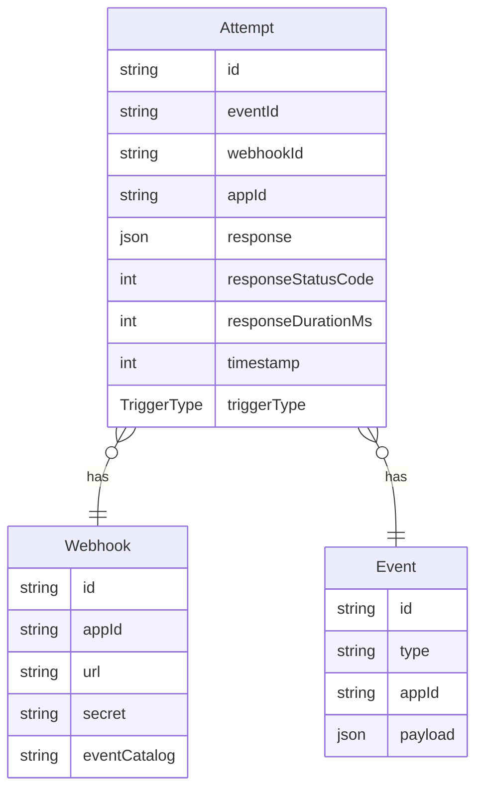

```prisma
    enum TriggerType {
      API
      UI
    }
```


```mermaid
erDiagram
    Webhook {
        string id
        string appId
        string url
        string secret
        string eventCatalog
    }
    
    Event {
        string id
        string type
        string appId

        %% {"event":"payment.created","paymentId":"456","details":{"amount":1000,"currency":"usd","country":"us"}}
        json payload
    }
    
    Attempt {
        %% atmpt_2qf7lixI55GDaZ8MpIx5t6see63
        string id
        string eventId
        string webhookId
        string appId
        
        json response
        int responseStatusCode
        int responseDurationMs
        int timestamp
        TriggerType triggerType
    }
    
    Attempt }o--|| Webhook : "has"
    Attempt }o--|| Event : "has"
```